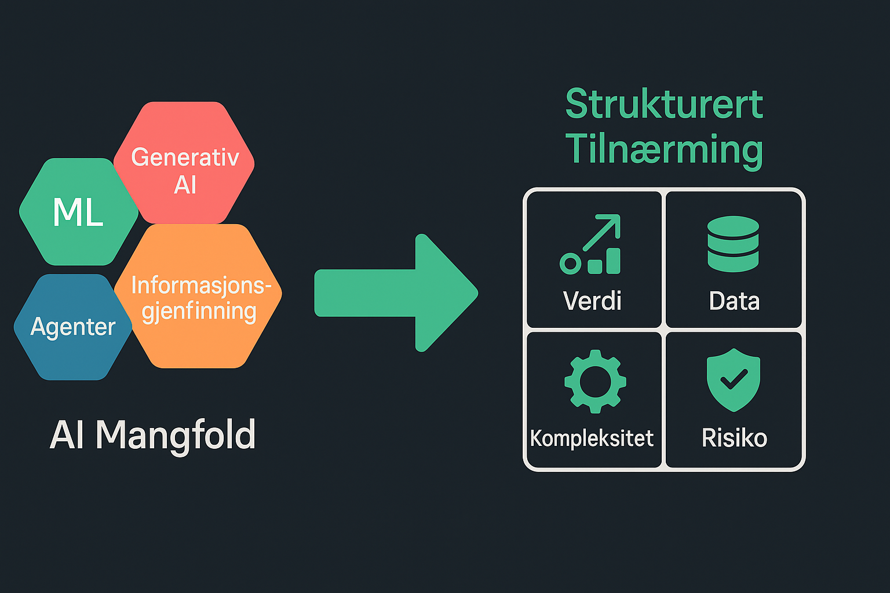

---
# theme id, package name, or local path
# Learn more: https://sli.dev/guide/theme-addon.html#use-theme
theme: default
# addons, can be a list of package names or local paths
# Learn more: https://sli.dev/guide/theme-addon.html#use-addon
addons: []
# title of your slide, will inferred from the first header if not specified
title: Hvordan velge riktig AI-teknologi?
# titleTemplate for the webpage, `%s` will be replaced by the slides deck's title
titleTemplate: '%s - AI Valg'
# information for your slides, can be a Markdown string
info: |
  En presentasjon om valg av AI-teknologi (ML, GenAI, Agenter, informasjonsgjenfinning) for ulike use cases. Fokus på forretningsverdi og nøkkelkriterier.
# author field for exported PDF or PPTX
author: Thomas Hjelde Thoresen
# keywords field for exported PDF, comma-delimited
keywords: AI, Maskinlæring, Generativ AI, LLM, AI Agenter,
  informasjonsgjenfinning, RAG, Teknologi Valg

# enable presenter mode, can be boolean, 'dev' or 'build'
presenter: true
# enable browser exporter, can be boolean, 'dev' or 'build'
browserExporter: dev
# enabled pdf downloading in SPA build, can also be a custom url
download: false
# filename of the export file
exportFilename: slidev-exported
# export options
# use export CLI options in camelCase format
# Learn more: https://sli.dev/guide/exporting.html
export:
  format: pdf
  timeout: 30000
  dark: false
  withClicks: false
  withToc: false
# enable twoslash, can be boolean, 'dev' or 'build'
twoslash: true
# show line numbers in code blocks
lineNumbers: false
# enable monaco editor, can be boolean, 'dev' or 'build'
monaco: true
# Where to load monaco types from, can be 'cdn', 'local' or 'none'
monacoTypesSource: local
# explicitly specify extra local packages to import the types for
monacoTypesAdditionalPackages: []
# explicitly specify extra local modules as dependencies of monaco runnable
monacoRunAdditionalDeps: []
# download remote assets in local using vite-plugin-remote-assets, can be boolean, 'dev' or 'build'
remoteAssets: false
# controls whether texts in slides are selectable
selectable: true
# enable slide recording, can be boolean, 'dev' or 'build'
record: dev
# enable Slidev's context menu, can be boolean, 'dev' or 'build'
contextMenu: true
# enable wake lock, can be boolean, 'dev' or 'build'
wakeLock: true
# take snapshot for each slide in the overview
overviewSnapshots: false

# force color schema for the slides, can be 'auto', 'light', or 'dark'
colorSchema: dark
# router mode for vue-router, can be "history" or "hash"
routerMode: history
# aspect ratio for the slides
aspectRatio: 16/9
# real width of the canvas, unit in px
canvasWidth: 980
# used for theme customization, will inject root styles as `--slidev-theme-x` for attribute `x`
themeConfig:
  primary: '#61D790' # Vespa green
  primaryLight: '#A4E1B5'
  background: '#eeeeee'
  backgroundDark: '#1E1E1E'
  backgroundLight: '#F5F5F5'

# favicon, can be a local file path or URL
favicon: '../../assets/favicon-green.png'
# URL of PlantUML server used to render diagrams
# Learn more: https://sli.dev/features/plantuml.html
plantUmlServer: https://www.plantuml.com/plantuml
# fonts will be auto-imported from Google fonts
# Learn more: https://sli.dev/custom/config-fonts.html
fonts:
  sans: Space Grotesk
  serif: Space Grotesk
  mono: IBM Plex Mono

# default frontmatter applies to all slides
defaults:
  layout: default
  # ...

  # drawing options
  # Learn more: https://sli.dev/guide/drawing.html
drawings:
  enabled: true
  persist: false
  presenterOnly: false
  syncAll: true

# HTML tag attributes
htmlAttrs:
  dir: ltr
  lang: no # Changed language to Norwegian

# SEO meta tags
seoMeta:
  ogTitle: Hvordan velge riktig AI-teknologi?
  ogDescription: En presentasjon om valg av AI-teknologi (ML, GenAI, Agenter,
    informasjonsgjenfinning) for ulike use cases.
  ogImage: https://cover.sli.dev # Consider replacing with a custom image
  ogUrl: https://example.com # Replace with actual URL if hosted
  twitterCard: summary_large_image
  twitterTitle: Hvordan velge riktig AI-teknologi?
  twitterDescription: En presentasjon om valg av AI-teknologi (ML, GenAI, Agenter,
    informasjonsgjenfinning) for ulike use cases.
  twitterImage: https://cover.sli.dev # Consider replacing with a custom image
  twitterSite: username # Replace with actual Twitter handle
  twitterUrl: https://example.com # Replace with actual URL if hosted

layout: two-cols
---

# Hvordan velge riktig AI-teknologi?

**Tradisjonell ML, Generativ AI, Agenter, informasjonsgjenfinning mot ulike use cases**

Hvorfor riktig AI-valg er avgjørende for suksess.

Thomas Hjelde Thoresen

07.05.2025

::right::

<!--
Velkommen!
AI-landskapet er komplekst med mange teknologier og mye "hype".
Feil valg kan føre til bortkastede ressurser.
Nøkkelen: Fokusere på *forretningsproblemet* eller *verdien* AI skal skape. Unngå "teknologifellen".
-->

---
layout: two-cols
transition: slide-left
---

# Agenda: Veien til riktig AI-valg

1.  Forstå de ulike AI-verktøyene (funksjonelt)
2.  Koble teknologi til forretningsbehov
3.  Nøkkelkriterier for valg
4.  Oppsummering og neste steg

::right::

<!--
Kontekst: Mange AI-begreper (ML, GenAI, Agenter, RAG).
Utfordring: Unngå feilinvesteringer.
Mål: Strukturert tilnærming basert på verdi.
-->

---
layout: two-cols-header
transition: slide-left
---

# Forstå AI-verktøykassen: Hva *gjør* de?

::left::

<h3 class="font-semibold text-primary">1. Prediktiv AI (Tradisjonell ML)</h3>
<ul>
  <li><b>Funksjon:</b> Forutsi utfall / klassifisere data basert på historikk.</li>
  <li><b>Eksempel:</b> Kundefrafall, salgsprognoser, spam-filter.</li>
</ul>

<h3 class="font-semibold text-primary">2. Generativ AI (LLM, VLM etc.)</h3>
<ul>
  <li><b>Funksjon:</b> Skaper nytt, originalt innhold (tekst, bilder, kode).</li>
  <li><b>Eksempel:</b> Utkast til markedsføring, rapporter, kodeforslag.</li>
</ul>

::right::

<h3 class="font-semibold text-primary">3. Handlingsorientert AI (Agenter)</h3>
<ul>
  <li><b>Funksjon:</b> Handler autonomt for å nå mål, tar beslutninger.</li>
  <li><b>Eksempel:</b> Automatisere prosesser, avansert kundeservice.</li>
</ul>

<h3 class="font-semibold text-primary">4. Informasjonsgjenfinning</h3>
<ul>
  <li><b>Funksjon:</b> Finner relevant, spesifikk informasjon fra store datamengder.</li>
  <li><b>Eksempel:</b> RAG for faktabaserte svar, internt kunnskapssøk.</li>
</ul>

---
layout: two-cols-header
transition: slide-left
---

# Koble teknologi til behov: Hvilken AI for hvilken jobb?

Match AI-funksjon til kjernen i forretningsbehovet.

**Når du trenger å...**

<mdi-alert-circle-outline class="inline-block"/> Ofte er en <i>kombinasjon</i> av teknologier nødvendig for komplekse løsninger (f.eks. RAG = informasjonsgjenfinning + Generativ).

::left::

<ul>
  <li v-click> Gi et estimat med usikkerhet og forklarbarhet for en boligverdi.</li>
  <li v-click>Generere en rapport basert på data.</li>
  <li v-click>Generere en presentasjon basert på tekstbeskrivelse.</li>
</ul>

::right::

<ul>
  <li v-click>Gi et tekstbasert svar gitt en kunnskapsbase.</li>
  <li v-click>Finne raskeste rute fra Island til Irland.</li>
  <li v-click>Finne optimal ladestrategi for en elektrisk ferge basert på strømprisprognoser, fergeplan og værdata.</li>
</ul>

---
layout: two-cols-header
transition: slide-left
---

# Nøkkelkriterier for valg: Sjekklisten før start

Utover funksjonell match, vurder disse kritiske faktorene:

::left::

<h3 class="font-semibold"><mdi-target class="inline-block text-primary"/> 1. Problem & Verdi</h3>
<ul class="list-disc pl-5">
  <li>Løser vi et <b>reelt</b> forretningsproblem?</li>
  <li>Hva er den <b>målbare</b> verdien/gevinsten (ROI)?</li>
</ul>

<h3 class="font-semibold"><mdi-database class="inline-block text-primary"/> 2. Data</h3>
<ul class="list-disc pl-5">
  <li>Har vi <b>tilgang</b> til nødvendige data?</li>
  <li>Er data av <b>god nok kvalitet</b> (nøyaktighet, relevans, bias)?</li>
  <li>Er bruken <b>lovlig</b> (GDPR, IP, taushetsplikt)?</li>
</ul>

::right::

<h3 class="font-semibold"><mdi-cogs class="inline-block text-primary"/> 3. Kompleksitet & Kompetanse</h3>
<ul class="list-disc pl-5">
  <li>Er løsningen <b>teknisk gjennomførbar</b>? </li>
  <li>Har vi <b>intern kompetanse</b>?</li>
  <li>Er det <b>enkelt å bruke</b> for sluttbruker?</li>
</ul>

<h3 class="font-semibold"><mdi-shield-check-outline class="inline-block text-primary"/> 4. Risiko, Etikk & Regulering</h3>
<ul class="list-disc pl-5">
  <li>Hva er <b>risikoene</b> (sikkerhet, feil, bias, omdømme)?</li>
  <li>Forklarbarhet, etikk og transparens?</li>
  <li>Hvilke <b>regulatoriske krav</b> gjelder?</li>
</ul>

<!--
En grundig vurdering på tvers av disse dimensjonene er avgjørende.
Ikke hopp over noen av punktene.
Dette hjelper med å prioritere og avdekke potensielle fallgruver tidlig.
-->

---
layout: two-cols-header
transition: slide-left
---

# Oppsummering & Veien Videre

<strong>Hovedpoeng:</strong>

<ul class="list-disc pl-5">
  <li v-click>Start med <strong>forretningsbehovet</strong>, ikke teknologien.</li>
  <li v-click>Forstå hva de ulike AI-typene <strong>gjør</strong>.</li>
  <li v-click>Match <strong>funksjon</strong> til oppgave.</li>
  <li v-click>Vurder <strong>nøkkelkriterier</strong> (verdi, data, kompleksitet, risiko).</li>
</ul>

::left::

<strong>Anbefaling:</strong>

<mdi-rocket-launch-outline class="inline-block"/> Start i det små! Identifiser 1-2 lovende use cases for <strong>pilotering</strong> for å teste og lære.

<strong>Fremtiden:</strong>

<mdi-chart-line class="inline-block"/> AI utvikler seg raskt (Agenter, Multimodal AI). Vær <strong>tilpasningsdyktig</strong>.

::right::

<mdi-comment-question-outline class="text-8xl text-primary opacity-80"/>

Hvilke muligheter finnes i <b>din</b> virksomhet?

Start diskusjonen internt!

<button @click="$slidev.nav.next" class="p-2 px-4 rounded bg-primary text-black">
  Avslutt <mdi-arrow-right class="inline-block"/>
</button>

<!--
Ikke bli overveldet av mulighetene.
En strukturert tilnærming og fokus på verdi er nøkkelen.
Start med et konkret, håndterbart problem.
Lær og iterer.
-->

---
layout: center
---

# Takk for oppmerksomheten!

**Spørsmål?**

<a href="https://www.linkedin.com/in/thomashthoresen/" target="_blank"><mdi-linkedin />Thomas Hjelde Thoresen</a>
 
<mdi-email-outline class="inline-block"/> thomas@vespa.ai

<!--
Slidev på bunnen av siden.
-->

  <PoweredBySlidev />

